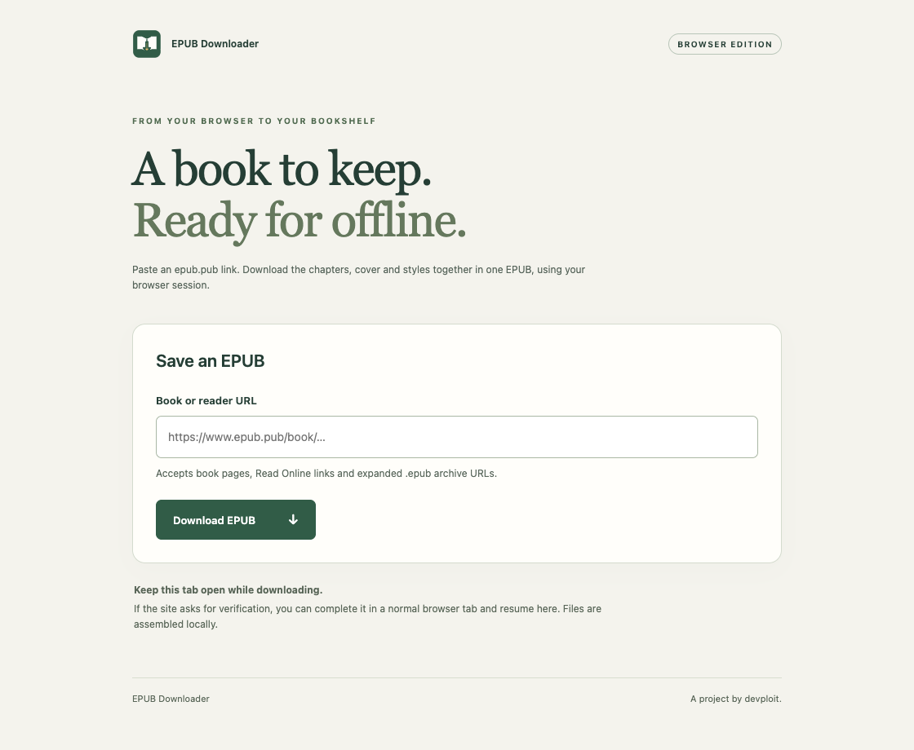

<p align="center">
  
</p>

<h1 align="center">EPUB Downloader</h1>

<p align="center">Save a book for offline reading. A browser extension by <strong>devploit</strong>.</p>

Download complete EPUB books from **epub.pub** using your existing browser session.
Paste a book or reader URL, download its resources, and save a single `.epub` file
with the original chapters, images, styles and reading order.

**No server, account, build step, or runtime dependencies.** Everything is assembled
locally in your browser.



## Features

- **Browser-based downloads:** requests run in epub.pub tabs using your existing session.
- **Complete archives:** preserves package metadata, navigation, chapters, covers,
  images, styles and fonts listed in the EPUB manifest.
- **Current and legacy readers:** supports Next.js Read Online buttons and older links.
- **Verification and resume:** complete site verification in a normal tab, then
  continue from the paused resource.
- **Progress and cancellation:** track downloaded files and cancel a running task.
- **Checked before saving:** missing or failed required resources stop the download.
  A cancelled save can be retried without downloading the book again.

## Install

Use **Chrome 120+**, or a recent Chromium-based version of **Edge** or **Brave**.
Chrome/Chromium is verified; Edge and Brave have not been tested separately.
Firefox and Safari are not supported by this package.

1. Download the repository with **Code → Download ZIP** and extract it, or clone it.
2. Open your browser's extension manager:

   | Browser | Address |
   | --- | --- |
   | Chrome | `chrome://extensions` |
   | Edge | `edge://extensions` |
   | Brave | `brave://extensions` |

3. Enable **Developer mode**.
4. Select **Load unpacked** and choose the repository's **`extension`** directory.
5. Pin **EPUB Downloader by devploit** from the browser's extensions menu.

If you received `epub-downloader-extension.zip`, extract it and select the extracted
folder containing `manifest.json` instead. You do not need Node.js or Python to
install or use the extension.

## Use

1. Click the extension icon to open the downloader. An active epub.pub tab's URL
   is filled in automatically.
2. Paste a supported URL and select **Download EPUB**.
3. Keep the downloader and its source tabs open while files are collected.
4. If verification is requested, select **Open source tab**, complete it normally,
   return to the downloader, and select **Resume download**.
5. Choose where to save the EPUB. **Saved** means the browser has confirmed completion.

Supported URL formats:

| Source | Format |
| --- | --- |
| Book page | `https://www.epub.pub/book/<book-slug>` |
| Swipe reader | `https://spread.epub.pub/epub/<asset-id>` |
| Continuous reader | `https://continuous.epub.pub/epub/<asset-id>` |
| Expanded archive | `https://asset.epub.pub/epub/<filename>.epub` |
| Package document | An `.opf` URL inside an expanded `.epub` archive |

These are URL patterns; replace the placeholders with an actual book or reader URL.

## How it works

The extension resolves the reader's archive URL, reads `META-INF/container.xml`
and the EPUB package documents, then fetches the resources listed in their
manifests. Each origin is accessed through a normal browser tab using same-origin
requests with browser credentials.

It assembles the archive locally, places the uncompressed `mimetype` entry first,
and hands the finished file to the browser's download manager. The original package
documents and resource bytes are preserved. Source tabs remain open after download.

## Privacy and permissions

The extension has no analytics, remote scripts, external backend, or account system.
It does not export cookies or access them through the cookies API. Requests to
epub.pub still use the browser session, and the site receives those requests normally.

| Permission | Purpose |
| --- | --- |
| `scripting` | Read book and reader pages; fetch resources inside source tabs. |
| `downloads` | Save the EPUB and monitor completion. |
| `https://epub.pub/*`, `https://*.epub.pub/*` | Limit page access to epub.pub and its subdomains. |

## Limitations and troubleshooting

Using a browser session **does not guarantee access through Cloudflare**. The
extension does not solve challenges automatically; it pauses for manual verification.
Permanent access denials can still prevent a download.

| Situation | What to do |
| --- | --- |
| No EPUB reader was found | Open **Read Online** on the book page, then paste that reader URL into the extension. |
| Waiting for verification | Open the source tab, complete verification, return and resume. |
| HTTP error or missing resource | Check access in the source tab and try again. Failed required files are never silently skipped. |
| Save dialog cancelled | Select **Save EPUB** to retry without fetching the book again. |
| Source tab closed or navigated away | Start the download again and keep the source tabs open. |
| Extension updated on disk | Reload it in the extension manager, then reopen the downloader. |

Additional limits:

- Resources must be correctly listed in the source EPUB manifest. Undeclared
  dependencies cannot be discovered reliably.
- External manifest resources and explicit remote-resource declarations are rejected.
- Font-obfuscation metadata is preserved; other encryption is unsupported.
- Expanded EPUB archives are supported. Plain chapter pages and arbitrary standalone
  EPUB/ZIP downloads are not.
- Limits are **32 MiB per resource**, **256 MiB per book**, and **10,000 entries**.
- The book is assembled in memory. Closing or reloading the downloader discards
  progress; there is no persistent resume after restarting the browser.
- Files use ZIP STORE, so the saved EPUB can be larger than a compressed original.

## Development

Requirements: **Node.js 22+**, **npm**, and **Python 3** available as `python3`.
Python is used for packaging and independent ZIP inspection in the tests.

```sh
npm ci
npx playwright install chromium
npm run check
npm test
```

`npm run check` validates the manifest, permissions and JavaScript syntax.
The Playwright suite loads the real extension in Chromium with controlled site
fixtures and exercises saving, verification/resume, cancellation, retry behavior,
reader discovery, archive completeness and keyboard navigation. Saved archives
are independently inspected with Python's `zipfile`, including CRC checks.

A live download has also been verified in an existing Chrome session. Automated
fixtures keep the test suite independent of epub.pub availability and Cloudflare.

### Build a shareable ZIP

```sh
python3 scripts/package.py
```

This creates **`dist/epub-downloader-extension.zip`**, containing only the extension,
its user guide and the license. No compilation is required. Share this ZIP rather
than the full development repository.

### Repository layout

```text
extension/          Browser extension, icons and packaged user guide
scripts/            Source checks and distribution packaging
tests/              Browser integration and regression tests
docs/images/        README screenshots
LICENSE             MIT license and copyright notices
```

## Contributing

Bug reports and focused pull requests are welcome. Include your browser version,
the type of URL used, the displayed error and steps to reproduce the issue.
Avoid including cookies or other session data. For code changes, run the checks
above and add a regression test when fixing a bug.

## Acknowledgements

This project uses [mcombeau/epub_downloader](https://github.com/mcombeau/epub_downloader) by Mia Combeau as a reference.

## License

Created and maintained by **devploit**. Distributed under the [MIT license](LICENSE).
